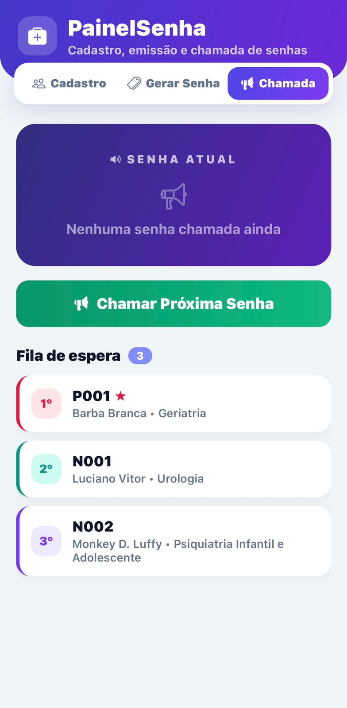
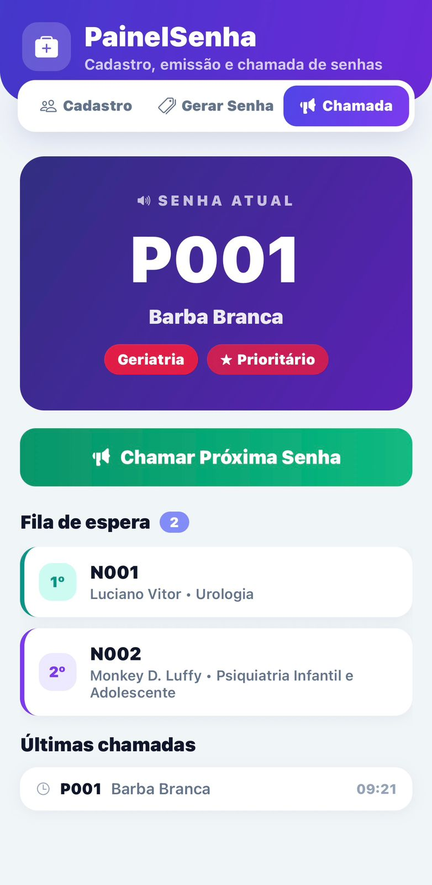

# 🏥 PainelSenha - Gestão de Atendimento e Chamada de Senhas

Este é um projeto desenvolvido em [**React Native**](https://reactnative.dev), criado para simular o fluxo completo de atendimento ambulatorial/hospitalar, abrangendo cadastro de pacientes com classificação etária/especialidade, emissão inteligente de senhas com prioridade e controle de fila de chamada em tempo real.

## 📱 Screenshots do Projeto

<div align="center">
  <table border="0">
    <tr>
      <td>
        <p align="center"><b>1. Cadastro Inicial</b></p>
        
      </td>
      <td>
        <p align="center"><b>2. Paciente Cadastrado</b></p>
        
      </td>
      <td>
        <p align="center"><b>3. Lista de Pacientes</b></p>
        
      </td>
      <td>
        <p align="center"><b>4. Gerar Senha</b></p>
        
      </td>
    </tr>
    <tr>
      <td>
        <p align="center"><b>5. Confirmação e Prioridade</b></p>
        
      </td>
      <td>
        <p align="center"><b>6. Fila de Espera</b></p>
        
      </td>
      <td>
        <p align="center"><b>7. Painel de Chamada Ativa</b></p>
        
      </td>
    </tr>
  </table>
</div>

---

# Getting Started

> **Note**: Make sure you have completed the [Set Up Your Environment](https://reactnative.dev/docs/set-up-your-environment) guide before proceeding.

## Step 1: Start Metro

First, you will need to run **Metro**, the JavaScript build tool for React Native:

```sh
# Using npm
npm start

# OR using Yarn
yarn start
